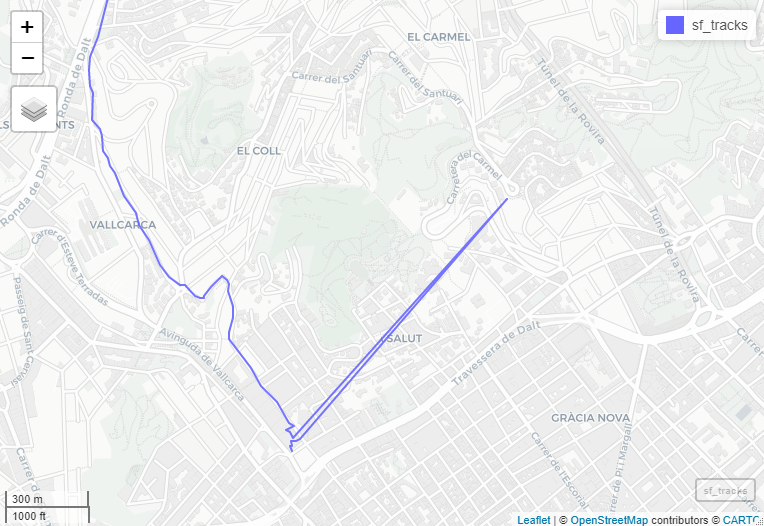

```{r setup, include=FALSE}
knitr::opts_chunk$set(echo = TRUE)
```


## Goal

To repair GPS data in a GPX file using R and generate a new correct GPX file  

## Context

I'm assuming you have a GPX file that is the result of recording some activity (trail running, for instance).

Why would you want to repair, that is to modify, GPS data contained in a GPX file? There are several reasons. GPS data quality depends on the device used. Your track can be split in several tracks because auto-pause was on. GPS signal is lost in some parts of your activity. Of course, as soon as you modify the raw data of your activity, you may get closer to reality (my intention) or far from it (cheating).

I run for fun and my only goal is to get my tracks closer to reality when there are obvious signals that this is not the case. I have a Samsung Active smart watch which I do not recommend for serious activity tracking. I have my activities tracked with Samsung Health and synchronized to Strava automatically. In one of these activities, Strava flagged my activity: "Check the activity type, crop vehicle portions or make the activity private to resolve". I want to show the way I resolved it in case it could be of interest to any of you.

## Read data

These are the packages I will use. As always in R, this is a matter of taste although I've tried many others before.

```{r, message=FALSE, warning=FALSE}
library(tidyverse)
library(sf)
library(mapview)
library(lubridate)
library(xml2)
```

We read first the relevant information within the gpx file. Take into account that every device and tracking software adds specific information (cardio info, derived measurements -- pace, terrain inclination). We will only read the minimum information (coordinates, track points time and, possibly, elevations) to create a modified GPX file with the corrected data.

### GPX file

Identify first the file or files to read

```{r}
file_name <-  "data/samsung_health/20210411_174627.gpx"
```

### Layers

Learn then the layers contained in the file. Usually you will have a track, the individual tracked points and others (for instance, waypoints). Each layer will be read in a different sf object. All metadata information is discarded at this stage.

```{r}
st_layers(file_name)
```

## Read track

```{r}
sf_tracks <- read_sf(file_name, layer = "tracks")
sf_track_points <- read_sf(file_name, layer = "track_points")
```

At this point, we get rid of all features that are not elevation, time or the geometry feature itself (geometry column) for the track_points layer. For the tracks layer, only the geometry column is required. 

```{r}
sf_tracks_min <- sf_tracks %>% 
  select(geometry)
sf_track_points_min <- sf_track_points %>% 
  select(ele, time)
```

## Map tracks

We need now to map both tracks to look for issues so big that can be appreciated at naked eye. We can use `ggplot2` and many other packages but I found mapview really convenient. It is better to run it in the console because it will be open in Rstudio viewer and can be easily explored. Run the following simple code to visualize each tracked point

```
mapview(sf_track_points)
```

and this other to visualize the full track
 
```
mapview(sf_tracks)
``` 

## Find issues

The first visualization helps you to identify the point or points where there might some potential issues.
In our case, we have identify three issues:

1. From points 1 to 21, signal was wondering around. I remember clearly the track I followed.
2. Point 13 is completely out of any logic
3. From points 65 to 70, signal is lost and.

<!--
TBD: put the three images in a table with three columns
-->





## Fix Issues

### Fix issue 2

This issue is fixed by simply removing the anomalous point (13). We can do it in both geometries although we will use only one of them to create the modified track (track_points)

```{r}
sf_track_points_min_1 <- sf_track_points_min[-13, ]
```

### Fix issue 1

To correct this segment, we will run the following steps:

1. Interpolate the correct track between points 1 and 20.
1. Compute distances and cumulative distances of intervals between points 1 and 20
1. Deduce average pace between point 1 and point 20
1. Build the time for each point intermediate point assuming average speed
1. Replace the 20 first points by the new track

To recreate the track followed between point 1 and 20, I recommend to use [onthegomap](https://onthegomap.com/). You create the replacing track and export it into a gpx file. It may require a bit of trial and error. 


```{r}
st_layers("data/onthego/onthegomap-issue1-route.gpx")
```

Note that now we have the track as a route

```{r}
sf_issue1 <- read_sf("data/onthego/onthegomap-issue1-route.gpx", layer = "route_points")
sf_issue1_min <-  sf_issue1 %>%  select(time, ele)
```

We add first and last point of the track we want to substitute to the new track

```{r}
sf_issue1_complete <- rbind(sf_track_points_min_1[1, ], sf_issue1_min, sf_track_points_min_1[20, ])
```

As the elevation measurement will not agree between the original track segment and the new one, we take the original as the truth (for consistency with the rest of track) and correct that of the new track. I'm assuming no change in elevation between the two last points to compute a fix gap to correct rest of elevations. 


```{r}
elevation_gap <- diff(sf_issue1_complete$ele[4:5])
sf_issue1_complete$ele[2:4] <- sf_issue1_complete$ele[2:4] + elevation_gap
sf_issue1_complete$ele
```

We need to compute the time for each new point. we compute these times assuming a constant pace. 

```{r}
dist_ab <- as.numeric(st_distance(sf_issue1_complete[c(1, 5), ])[1, 2])
time_ab <- as.numeric(diff(sf_issue1_complete$time[c(1, 5)]))
pace_ab <- dist_ab / time_ab
```

```{r}
sf_issue1_complete$time[2:4] <- 
  sf_issue1_complete$time[1] + as.numeric(st_distance(sf_issue1_complete)[2:4, 1]) / pace_ab
sf_issue1_complete$time
```

We replace the old part of the track (`sf_track_points_min_1[1:20, ]`) by the new one (`sf_issue1_complete`):

```{r}
sf_tracks_points_min_2 <- rbind(sf_issue1_complete, sf_track_points_min_1[-(1:20), ])
```

It would be possible to interpolate more points using `st_segmentize`. Nevertheless, I prefer to leave it this way as it clearly shows there was an intervention on the original track.

### Fix issue 3

I do not remember what it may have happened at this point (53). Points from 49 to 53 have the same location. It is like I stopped there. Nevertheless, from point 53 to point 54 there was no intermediate recording. I prefer to replace points 50 to 53 by 4 points evenly distributed between points 49 and 54, assuming constant pace. Note that the points of the issue here refer to the track points once issue 1 and issue 2 have been fixed. In the original track, they correspond to points 65 to 70. 

We create a function to interpolate equally spaced n points between two points in the plane as it allows full control of the number of points interpolated.

```{r}
# Take two points 
# function that takes an sf object of two points and returns and sf object with n + 2 points with times interpolated
# and elevation interpolated NA
# I prefer to use this function instead of st_segmentize to control the number of points interpolated. 
# The result should not be that different 
interpolate <- function(x, n) {
  time_ab <- as.numeric(diff(x$time))
  coord_ab <- st_coordinates(x)
  distance_ab <- dist(coord_ab)
  diff_coord <- diff(coord_ab) / (n + 1)
  new_points <- st_multipoint(matrix(
    c((1:n) * diff_coord[1, 1] + coord_ab[1, 1] , (1:n) * diff_coord[1, 2] + coord_ab[1, 2]), ncol = 2))
  sfc_new <- st_cast(st_sfc(new_points, crs = 4326), "POINT")
  sf_new <- st_sf(data.frame(time = x$time[1] + (1:n) * time_ab / (n + 1), ele = rep(NA, n)), geometry = sfc_new)
  sf_total <- rbind(x[1, ], sf_new, x[2, ])
}
```

```{r}
sf_two_points <- interpolate(sf_tracks_points_min_2[c(49, 54), ], 4)
sf_tracks_points_min_3 <- rbind(sf_tracks_points_min_2[1:48, ], sf_two_points, sf_tracks_points_min_2[55:1034, ])
```

We have now the track with the three issues corrected and we will next export the new track into a .gpx file

## Read 2nd track

We read a second track

```{r}
file_name2 <-  "data/samsung_health/20210411_184242.gpx"
st_layers(file_name2, )
```


```{r}
sf_track_points2 <- st_read(file_name2, layer = "track_points", drivers = "GPX", options = "GPX_USE_EXTENSIONS=YES")
```
```{r}
sf_track_points2 <- sf_track_points2 %>% 
  select(ele, time)
```

We repair the track from point 807 to 862 (860 better as it has elevation). First we create the right track with onthegomap.com

```{r}
sf_issue1_tr2 <- read_sf("data/onthego/onthegomap-issue1_track2.gpx", layer = "route_points")
sf_issue1_tr2 <- sf_issue1_tr2 %>% 
  select(ele, time)
```

```{r}
sf_issue1_tr2_complete <- rbind(sf_track_points2[808, ], sf_issue1_tr2, sf_track_points2[860, ])
```

```{r}
elevation_gap <- diff(sf_issue1_tr2_complete$ele[2:1])
sf_issue1_tr2_complete$ele[2:8] <- sf_issue1_tr2_complete$ele[2:8] + elevation_gap
sf_issue1_tr2_complete$ele
```

We need to compute the time for each new point. we compute these times assuming a constant pace. 

```{r}
dist_ab <- as.numeric(st_distance(sf_issue1_tr2_complete[c(1, 9), ])[1, 2])
time_ab <- as.numeric(as.duration(diff(sf_issue1_tr2_complete$time[c(1, 9)])))
pace_ab <- dist_ab / time_ab
```

```{r}
sf_issue1_tr2_complete$time[2:8] <- 
  sf_issue1_tr2_complete$time[1] + 
    as.numeric(st_distance(sf_issue1_tr2_complete)[2:8, 1]) / pace_ab
sf_issue1_tr2_complete$time
```

```{r}
sf_track_points2_min_1 <- rbind(sf_track_points2[1:807, ], sf_issue1_tr2_complete)
```


## Join both tracks

```{r}
sf_two_tracks <- rbind(sf_tracks_points_min_3, sf_track_points2_min_1)
```

## Write .gpx file

```{r}
# sf build

doc <- add_gpx(creator = "pep")
add_trk(doc2, df[1:10, ], name = "track_1")
add_trk(doc2, df[11:20, ], name = "track_2")
write_xml(doc2, file = "output_doble.gpx", options = c("format", "no_empty_tags"))
```
```{r}
library(xml2)
```

In this case, we created a couple of functions to build the gpx root node and a trk node.

```{r}
add_gpx <-  function(creator = "R - pep"){
  xml_new_root("gpx",
  version = "1.1",
  creator = creator,
  "xmlns:xsi"="http://www.w3.org/2001/XMLSchema-instance",
  xmlns="http://www.topografix.com/GPX/1/1",
  "xsi:schemaLocation"="http://www.topografix.com/GPX/1/1 http://www.topografix.com/GPX/1/1/gpx.xsd",
  "xmlns:gpxtpx"="http://www.garmin.com/xmlschemas/TrackPointExtension/v1")
}

add_trk <- function(parent, df, name = NULL) {
  trk_node <- xml_add_child(parent, "trk")
  n_points <- nrow(df)
  if(!is.null(name)) xml_add_child(trk_node, "name", name)
  # add trk, name, trkseg, trkpt
  trkseg_node <- xml_add_child(trk_node, "trkseg")
  for(k in 1:n_points) {xml_add_child(trkseg_node, "trkpt")}
  trkpt_nodes <- xml_find_all(trkseg_node, ".//trkpt")
  # create attribute lon, lat
  xml_set_attr(trkpt_nodes, "lat", df$lat)
  xml_set_attr(trkpt_nodes, "lon", df$lon)
  # create nodes ele and time if they exist 
  if("ele" %in% names(df)) xml_add_child(trkpt_nodes, "ele", df$ele)
  if("time" %in% names(df)) xml_add_child(trkpt_nodes, "time", df$time)
  return(invisible(parent))
}
```

Now, you build the complete xml tree with the two tracks nodes

```{r}
df <-st_coordinates(sf_two_tracks) %>%
  as.data.frame() %>% 
  rename(lat = Y, lon = X) %>% 
  bind_cols(as.data.frame(sf_two_tracks[, c("ele", "time")]))
```

```{r}
df$ele[is.na(df$ele)] <- ""
df$time <- strftime(df$time, "%Y-%m-%dT%H:%M:%SZ", tz = "GMT")
```


```{r}
doc2 <- add_gpx()
add_trk(doc2, as.data.frame(df), name = "turo de valldaura-font de la marquesa")
resp <- write_xml(doc2, file = "data/samsung_health/20210411_one_track.gpx", options = c("format", "no_empty_tags"))
```


